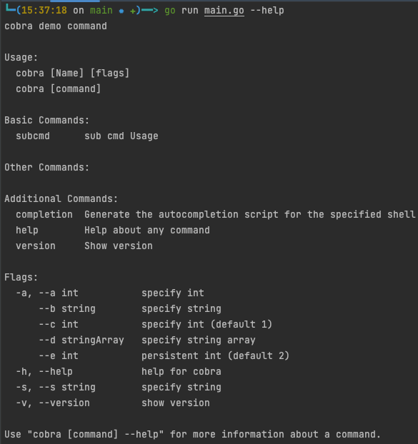
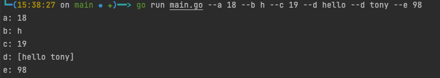
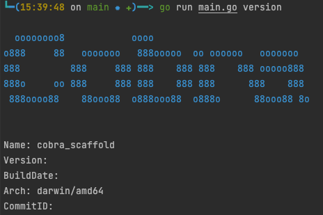
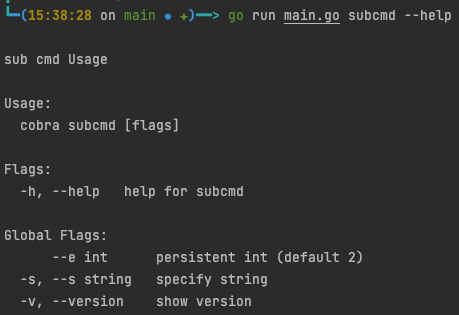
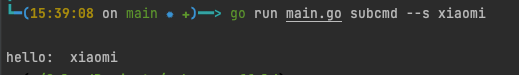

# Cobra 脚手架
## 根命令使用
```bash 
go run main.go --help    
```

```bash 
go run main.go --a 18 --b h --c 19 --d hello --d tony --e 98 
```

```bash
go run main.go version
```


## 子命令使用
```bash
go run main.go subcmd --help
```

```bash
go run main.go subcmd --s xiaomi 
```


## 交叉编译脚本
编译安装在本地
```bash
sh .cross_compile.sh install
```
删除本地安装
```bash
sh .cross_compile.sh uninstall
```
编译多个架构
```bash
sh .cross_compile.sh 
```

